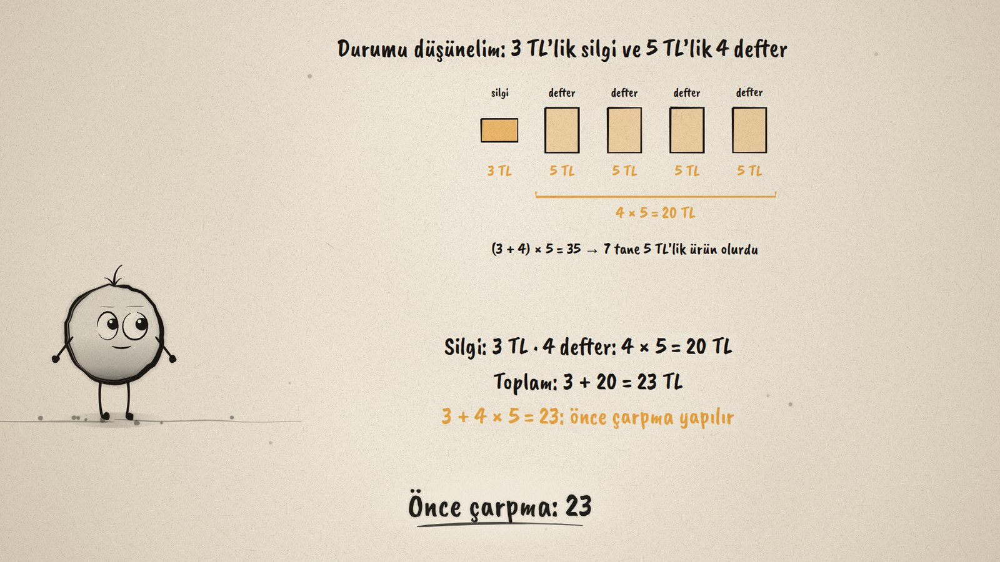
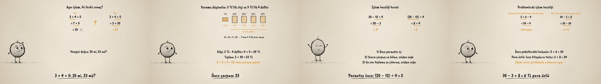

# Önce Hangisi? · Order of Operations

**▶ Tarayıcıda izleyin / Watch in the browser:** https://hakanatas.github.io/once-hangisi/ 
**⬇ MP4 + altyazılar / MP4 + subtitles:** [Releases](https://github.com/hakanatas/once-hangisi/releases) 
**✎ Kullanılan istem / The prompt behind it:** [PROMPT.md](PROMPT.md) 
**🎞 Bütün filmler / All films:** [Nokta'nın Filmleri](https://hakanatas.github.io/nokta-filmleri/?sinif=5)

> **TR —** 5. sınıf matematik "İşlemlerle Cebirsel Düşünme" temasındaki MAT.5.2.2 öğrenme çıktısı için hazırlanmış, tamamen JavaScript ile çizilen 92 saniyelik mürekkep animasyonu. Ece ve Can aynı işlemi yapıyor, 3 + 4 × 5: biri 35, diğeri 23 buluyor. İşlem bir alışverişle inceleniyor: 3 TL'lik silgi ve 5 TL'lik 4 defter; defterler 4 × 5 = 20 TL, toplam 23 TL. Önce çarpma yapılıyor; 35 bulmak 7 tane 5 TL'lik ürün demek olurdu. Kural adım adım uygulanıyor, her adımda sıradaki işlemin altı çiziliyor: önce parantez içi, sonra çarpma ve bölme, en son toplama ve çıkarma (20 − 12 ÷ 4 = 17, (20 − 12) ÷ 4 = 2); aynı öncelikte olanlar soldan sağa (18 ÷ 3 × 2 = 12, 10 − 4 + 3 = 9). Son olarak iki problemde işlem önceliği açıklanıyor: 5 × 6 − 4 = 26 kalem, 30 − 3 × 8 = 6 TL para üstü. Altyazılar Türkçe, İngilizce ya da ikisi birlikte seçilebilir.

A 92-second ink animation for **5th-grade maths**. Nokta, the ink character from [The Learning Ink](https://github.com/hakanatas/the-learning-ink), is the guide again. Every calculation is a list of steps (`steps` in `scenes/scene1.js`); just before each new line appears, the part of the previous line that is done next is underlined in amber, so the order is visible, not only stated.

## Learning outcome

MEB, Türkiye Yüzyılı Maarif Modeli, Ortaokul Matematik, 5th grade, "İşlemlerle Cebirsel Düşünme" theme:

**MAT.5.2.2. Karşılaştığı günlük hayat ya da matematiksel durumlarda işlem önceliğini yorumlayabilme**
- a) Doğal sayılarla dört işlem içeren problemlerde ve sayı cümlelerinde işlem önceliğini inceler.
- b) Karşılaştığı doğal sayılarla dört işlem içeren problemlerde ve sayı cümlelerinde işlem önceliğini uygular.
- c) Karşılaştığı durumlarda işlem önceliğini açıklar.

## Scenes

| # | Time | Scene | What happens | Outcome |
|---|---|---|---|---|
| 1 | 0–10 s | İki sonuç | 3 + 4 × 5: Ece gets 35, Can gets 23. | a |
| 2 | 10–28 s | Durumu düşün | A 3 TL rubber and four 5 TL notebooks: 23 TL; multiply first. | a, c |
| 3 | 28–46 s | Kural | Brackets, then × and ÷, then + and −: 20 − 12 ÷ 4 = 17, (20 − 12) ÷ 4 = 2. | b |
| 4 | 46–64 s | Soldan sağa | Same level, left to right: 18 ÷ 3 × 2 = 12, 10 − 4 + 3 = 9. | b |
| 5 | 64–80 s | Problemlerde | 5 × 6 − 4 = 26 pencils; 30 − 3 × 8 = 6 TL change. | b, c |
| 6 | 80–92 s | Aklında kalsın | Brackets, × ÷, + −, left to right. | a–c |

## Running it

- **Preview:** double-click `index.html` (it works offline).
- **MP4:** run `npm install` once, then `npm run export -- --format=horizontal --captions=tr`.
- **Subtitles and narration:** `npm run srt` writes `out/captions_*.srt` and `narration_notes.txt`.
- **Editing:**
  - Caption text, timings and narration notes: `captions.js`
  - Everything on screen is drawn by `LI.world(t)` in `scenes/scene1.js` (the step columns, the shopping items, the words); the other scenes only set the camera.
  - Nokta's poses: `src/draw/film.js`; layout for 16:9 and 9:16: `src/draw/kd.js`

It uses the same engine as The Learning Ink: `renderFrame(t)` as a pure function of time, seeded randomness, and frame-by-frame export.

## Lisans · License

**TR —** Bu film ve kodu [Creative Commons Atıf-GayriTicari 4.0 Uluslararası (CC BY-NC 4.0)](https://creativecommons.org/licenses/by-nc/4.0/deed.tr) lisansıyla paylaşılır. Ticari olmayan her amaçla (derste, okulda, eğitim materyalinde) kopyalayabilir, paylaşabilir ve değiştirebilirsiniz; ancak **kaynak göstermek zorunludur**: eser sahibinin adı ve bu deponun bağlantısı belirtilmeden kullanılamaz. Ticari kullanım (satış, ücretli ürün ya da yayın) için izin alınmalıdır.

**EN —** This film and its code are licensed under [Creative Commons Attribution-NonCommercial 4.0 International (CC BY-NC 4.0)](https://creativecommons.org/licenses/by-nc/4.0/). You may copy, share and adapt them for non-commercial purposes, but **attribution is required**: they may not be used without crediting the author and linking to this repository. Commercial use requires permission.

Atıf örneği / Required credit: *“Önce Hangisi?”, Hakan Ataş, Nokta'nın Filmleri — https://github.com/hakanatas/once-hangisi — CC BY-NC 4.0*
